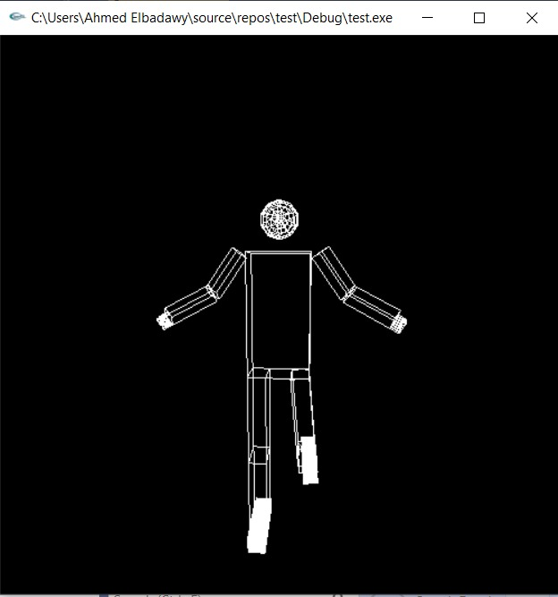
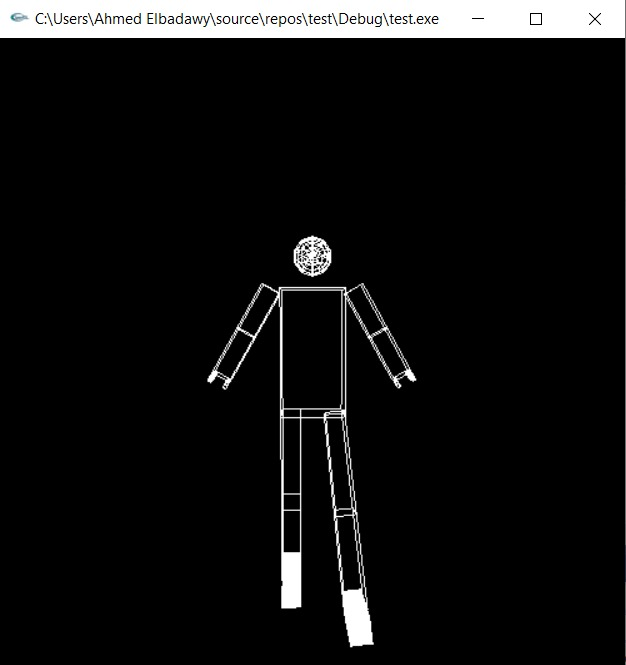
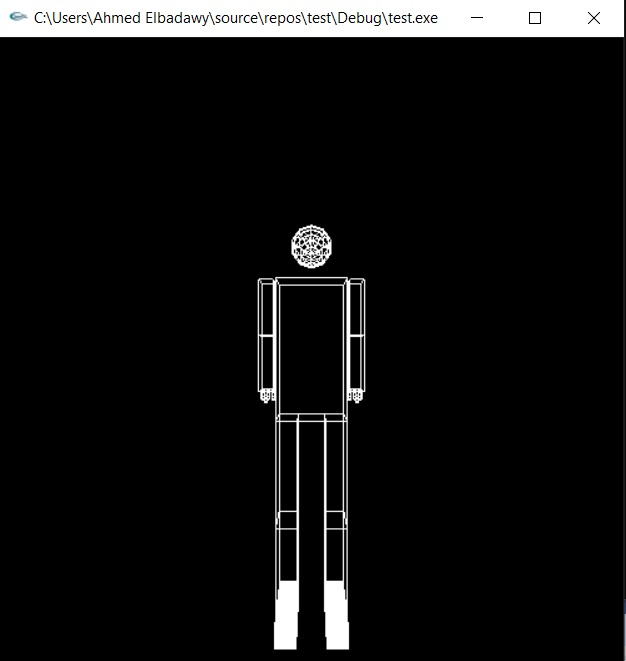
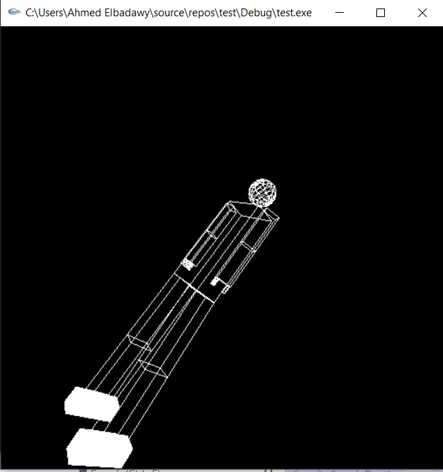

# Articulated 3D Human Figure — OpenGL / GLUT

An interactive 3D articulated human figure built with OpenGL and GLUT. Every joint in the body is independently controllable via keyboard, with full 3D camera navigation using mouse drag and arrow keys.

---






---

## Features

- Hierarchical scene graph using OpenGL matrix stacks — each limb inherits its parent's transform
- Full upper body control: shoulders, elbows (both lateral and frontal rotation planes)
- Full lower body control: femurs, tibias, and front-facing leg rotation
- Detailed hands with individually modelled thumb and three fingers per arm
- Solid feet rendered as filled geometry contrasting the wireframe body
- Free-look camera: mouse drag to orbit, arrow keys to look up/down/left/right, `f`/`b` to move forward and back, `r` to reset view

---

## Controls

### Camera
| Key | Action |
|---|---|
| Mouse drag | Orbit the scene |
| `←` `→` `↑` `↓` | Look left / right / up / down |
| `f` | Move forward |
| `b` | Move backward |
| `r` | Reset camera |

### Upper Body
| Key | Action |
|---|---|
| `s` | Swing both arms forward |
| `S` | Swing both arms back |
| `d` | Rotate both arms in frontal plane |
| `h` | Bend both elbows |
| `H` | Straighten both elbows |

### Lower Body
| Key | Action |
|---|---|
| `e` / `E` | Left femur forward / back |
| `t` / `T` | Right femur forward / back |
| `q` / `Q` | Left leg front rotation |
| `w` / `W` | Right leg front rotation |
| `u` / `U` | Left tibia bend / straighten |
| `y` / `Y` | Right tibia bend / straighten |

---

## Build & Run

### Prerequisites
- GCC or MSVC
- OpenGL + GLU
- GLUT or freeglut

### Linux / macOS
```bash
gcc main.c -o figure -lGL -lGLU -lglut -lm
./figure
```

### Windows (MinGW)
```bash
gcc main.c -o figure.exe -lfreeglut -lopengl32 -lglu32 -lm
figure.exe
```

---

## Skills

- C
- OpenGL (Legacy / Fixed-Function Pipeline)
- GLUT / freeglut
- Hierarchical 3D transforms (matrix stack)
- Camera mathematics (rotation, cross product, normalisation)
- Real-time keyboard & mouse input handling
- 3D scene composition

> A portfolio of graphics, signal processing, and full-stack web projects — including an interactive Z-plane digital filter visualiser built with Flask, NumPy, and D3.js.
